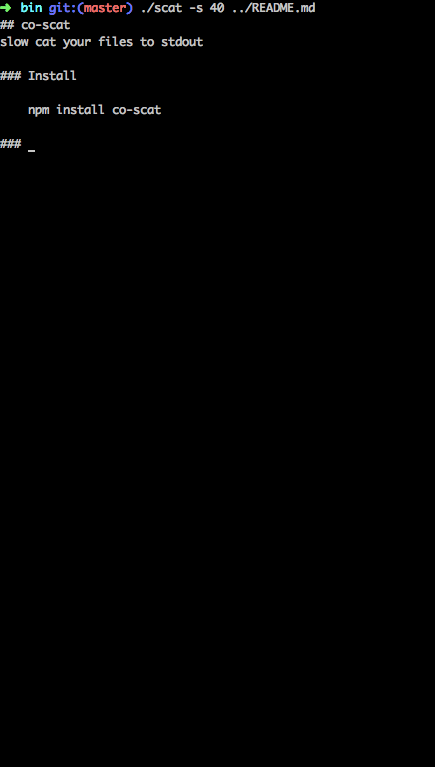

## co-scat
slow cat your files to stdout

### Install

    npm install co-scat

### Help

    scat -h

      Usage: scat [options]

      Options:

        -h, --help       output usage information
        -V, --version    output the version number
        -s, --sps <sps>  strings per second

      Report bugs to <jeremial90@gmail.com>

### CLI

    % scat -s 20 a.txt b.txt

### Node.js

    var scat = require('co-scat');
    var co = require('co');

    // slow cat file
    co(scat)('a.txt', 20);

    // or slow cat raw string
    co(scat.str)('raw string to output', 10);

    // or use in other functions
    co(function *(){
        yield scat('../index.js', 30);
    })();

### License
MIT